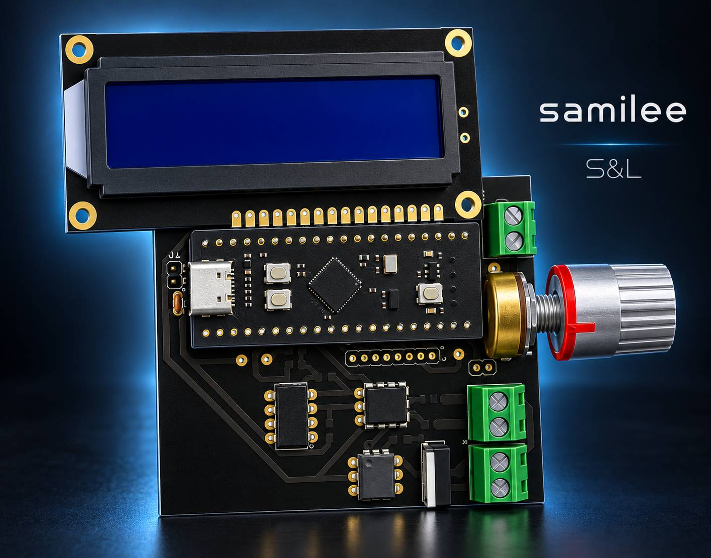
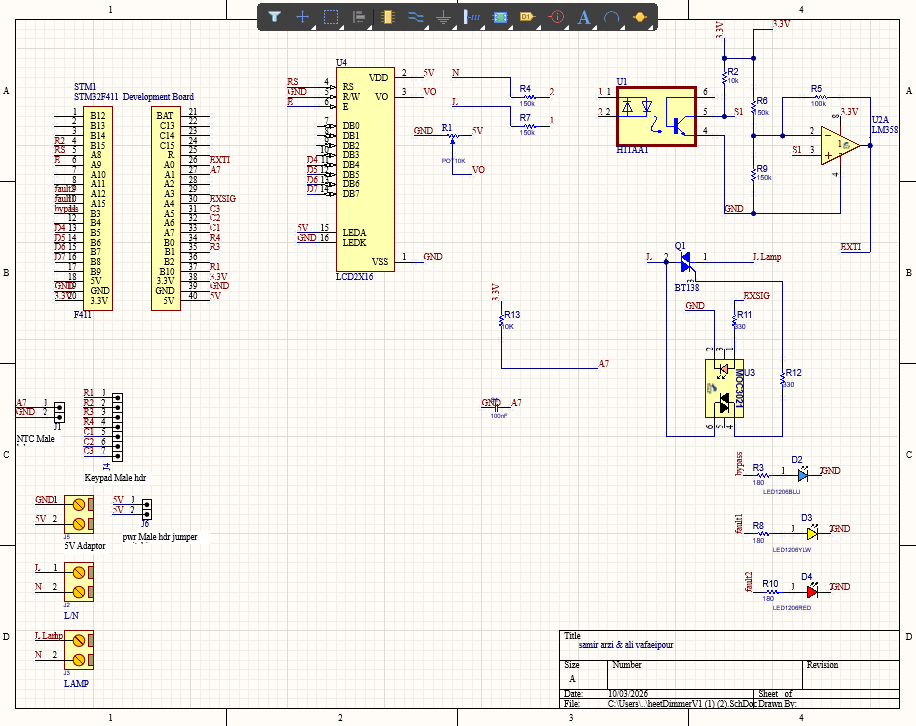
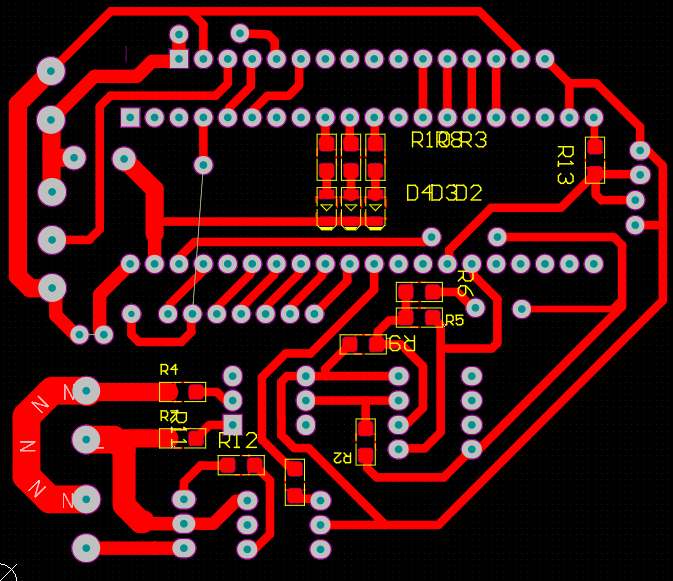
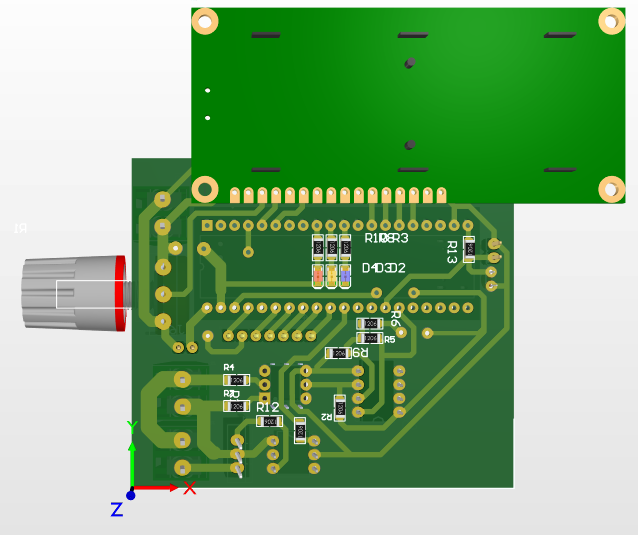
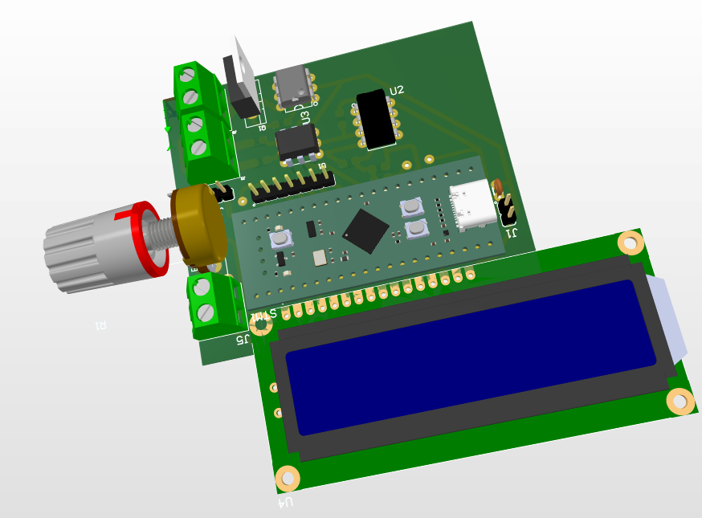
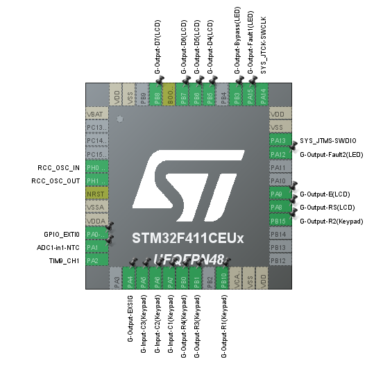
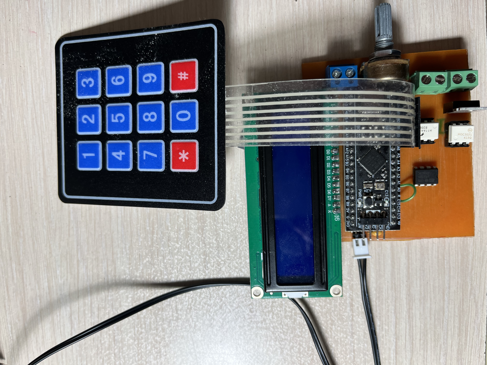
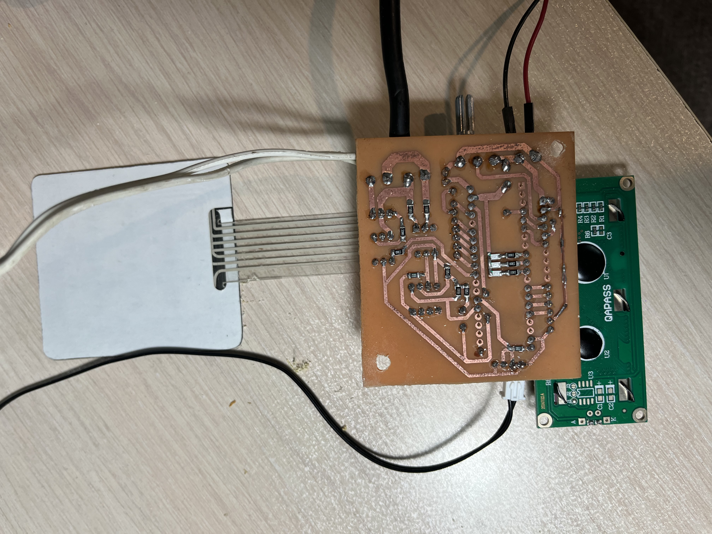

# Air Fryer Controller – PCB Design & Hardware Development

<p align="center">
  
</p>

<p align="center">
  <i>AI-generated project visualization — not a photograph of the actual project.</i>
</p>

An STM32-based air fryer controller featuring PID temperature control, a custom control board designed in Altium Designer, and a power electronics section developed as part of the overall system.

---

## Project Overview

This project is an STM32-based air fryer control system designed to manage the cooking process using temperature feedback and PID control.

The system consists of:

* Control electronics
* Power electronics
* STM32-based embedded software
* LCD and keypad user interface

The project was developed collaboratively as a university project, with responsibilities divided between control electronics, power electronics, PCB development, and software.

---

## Project Collaboration

<p align="center">

|                          Contributor                          | Main Responsibilities                                                                             |
| :-----------------------------------------------------------: | ------------------------------------------------------------------------------------------------- |
|                        **[Ali Vafaeipour]**                        | Control circuit design, PCB design, PCB fabrication, component assembly, LCD & keypad programming |
| **[Amirhossein Arzi](https://github.com/[Samirarzi])** | Embedded software development, power electronics design, and power-section implementation         |

</p>

---

## My Contribution

My main contribution to the project included:

* Control circuit design
* PCB design using **Altium Designer**
* Component placement and PCB routing
* PCB layout review
* PCB preparation for fabrication
* PCB fabrication using copper-clad board and chemical etching
* Manual drilling and PCB preparation
* Component soldering and assembly
* LCD and keypad programming
* Hardware testing and inspection

My work focused primarily on the **control electronics and control-board development**.

---

## Collaborator's Contribution

My collaborator was primarily responsible for:

* Embedded software development
* Main firmware development
* Power electronics circuit design
* Power-section development and implementation

The project was therefore developed as a collaboration between **control electronics, power electronics, and embedded software**.

---

## Hardware Design

### Schematic

<p align="center">
  
</p>

---

### PCB Layout – 2D

<p align="center">
  
</p>

---

### PCB Layout – 3D

<p align="center">
  
</p>

<p align="center">
  
</p>

---

## STM32 & User Interface

The project used an STM32 microcontroller and included an LCD and keypad interface for user interaction.

The microcontroller configuration was prepared using **STM32CubeMX**.

<p align="center">
  
</p>

My contribution to the software side focused on the **LCD and keypad interface programming**.

---

## PCB Fabrication

The PCB was physically fabricated using a copper-clad board and a chemical etching process.

### Fabrication Process

1. PCB layout preparation
2. PCB pattern transfer
3. Chemical etching
4. Manual drilling
5. Component placement
6. Soldering and assembly
7. Hardware inspection

This process converted the Altium PCB design into a functional physical prototype.

---

## Final Result

<p align="center">
  
</p>

<p align="center">
  
</p>

---

## Tools & Technologies

<p align="center">

|       Category       | Tool / Technology                     |
| :------------------: | ------------------------------------- |
|      PCB Design      | Altium Designer                       |
|   MCU Configuration  | STM32CubeMX                           |
|    Microcontroller   | STM32                                 |
|    Control Method    | PID Temperature Control               |
|    User Interface    | LCD + Keypad                          |
|      Programming     | Embedded C                            |
|    PCB Fabrication   | Copper-Clad Board + Chemical Etching  |
|       Assembly       | Manual Soldering                      |
| Hardware Development | Control Electronics & PCB Prototyping |

</p>

---

## Repository Structure

```text
Air-Fryer-Controller-PCB/
│
├── README.md
│
└── Images/
    ├── Schematic.png
    ├── PCB_2D.png
    ├── PCB_3D_1.png
    ├── PCB_3D_2.png
    ├── STM32CubeMX.png
    ├── AI_Project_Cover.jpg
    ├── Final_Project_1.jpeg
    └── Final_Project_2.jpeg
```

---

## Project Scope

This repository is intended as a **hardware and embedded-systems portfolio project**.

The following files are intentionally not included:

* Complete firmware source code
* Gerber files
* Altium Designer source/project files
* Manufacturing files

The repository provides selected documentation and visual references showing the **control-board design, PCB fabrication, assembly, STM32 configuration, and final hardware result**.

---

## Collaboration

This project was developed as a collaborative university project.

The work was divided between:

* Control electronics and PCB development
* Power electronics
* Embedded software
* LCD and keypad interface development

The repository highlights my specific contribution while acknowledging the collaborative nature of the project.

---

## Disclaimer

This repository documents my contribution to a collaborative university project and is intended for portfolio and educational purposes.
